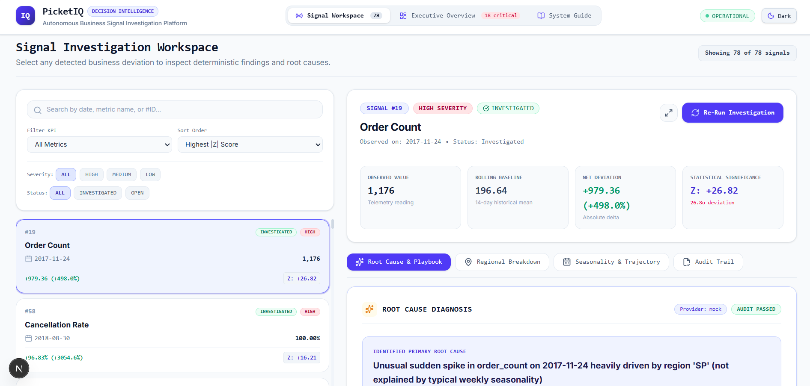
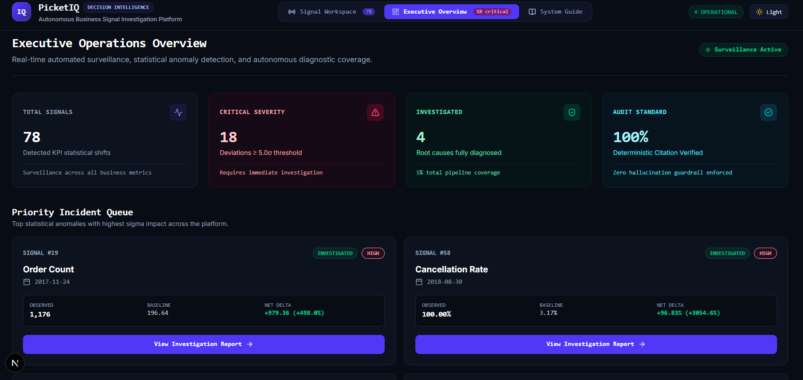
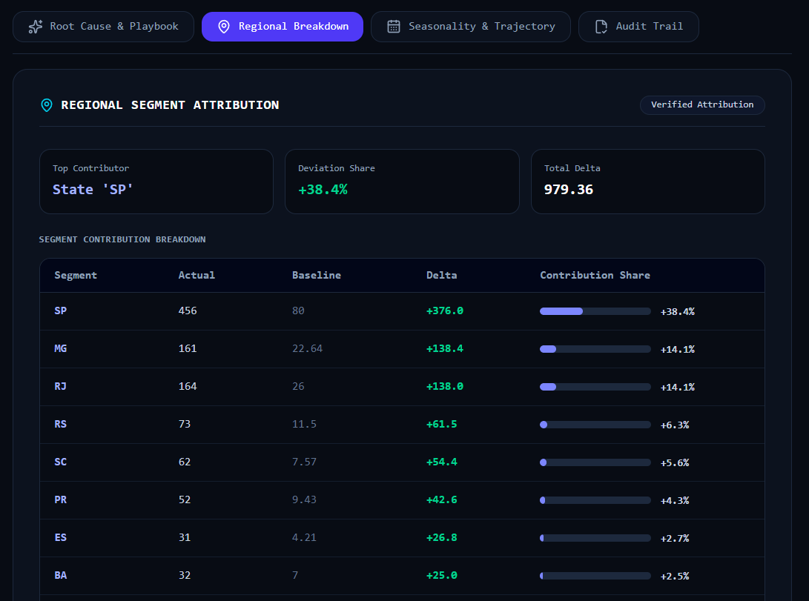

# PicketIQ

<div align="center">

### Autonomous Business Signal Investigation & Decision Intelligence Platform

> *"When the numbers move, PicketIQ finds out why."*

[](https://python.org)
[](https://fastapi.tiangolo.com)
[](https://nextjs.org)
[](https://www.typescriptlang.org)
[](https://www.postgresql.org)
[](https://tailwindcss.com)
[](#testing--verification)
[](#zero-hallucination-audit-shield)

</div>

---

## 🖼️ Platform Showcase

<div align="center">

### Executive Operations Overview (Light Mode)


### Real-Time Incident Investigation Workspace (Dark Mode)


### Multi-Dimensional Regional Breakdown & Seasonality Analysis


</div>

> **Tip**: Add your screenshots to the `docs/screenshots/` directory (`overview_light.png`, `investigation_dark.png`, `regional_breakdown.png`).

---

## 📌 The Problem & Solution

Traditional Business Intelligence dashboards (Tableau, Looker, Metabase) tell you **what** happened (e.g., *“Daily order volume spiked +498%”* or *“Cancellation rate jumped 15%”*). But discovering **why** requires data analysts to spend hours writing ad-hoc SQL queries to slice data across dozens of dimensions.

On the other hand, generic AI chatbots hallucinate numbers when asked analytical business questions.

**PicketIQ** bridges this gap. It is an **evidence-first decision intelligence platform** that continuously monitors daily business KPIs over real transactional databases, detects statistical anomalies, executes deterministic multi-dimensional SQL diagnostic tools, and uses an audit-shielded LLM to synthesize verified root causes and actionable mitigation playbooks in seconds.

---

## 🏗️ System Architecture

PicketIQ decouples **deterministic evidence gathering** from **AI natural-language synthesis** to guarantee 100% mathematical accuracy:

```
┌─────────────────────────────────────────────────────────────────────────┐
│                      REAL TRANSACTIONAL DATASET                         │
│               Olist Brazilian E-Commerce (451k+ Records)                │
└────────────────────────────────────┬────────────────────────────────────┘
                                     │
                                     ▼
┌─────────────────────────────────────────────────────────────────────────┐
│                       1. DAILY KPI ENGINE                               │
│  Computes standardized business metrics: order_count, revenue,          │
│  freight_value, cancellation_rate, delivery_delay_rate, review_score     │
└────────────────────────────────────┬────────────────────────────────────┘
                                     │
                                     ▼
┌─────────────────────────────────────────────────────────────────────────┐
│                   2. STATISTICAL ANOMALY DETECTOR                       │
│  14-day rolling baseline: computes volatility-adjusted Z-scores         │
│  Flags statistical outliers (|Z| ≥ 3.0σ) with severity ranking          │
└────────────────────────────────────┬────────────────────────────────────┘
                                     │
                                     ▼
┌─────────────────────────────────────────────────────────────────────────┐
│               3. DETERMINISTIC EVIDENCE TOOLS (Zero AI)                 │
│  • 01 Segment Breakdown: Regional state contribution (SP, RJ, MG, etc.) │
│  • 02 Seasonality Analysis: 8-week same-weekday historical comparison   │
│  • 03 Recent Trend: 14-day chronological slope regression               │
└────────────────────────────────────┬────────────────────────────────────┘
                                     │
                                     ▼
┌─────────────────────────────────────────────────────────────────────────┐
│             4. GROUNDED AI SYNTHESIS & AUDIT VALIDATION SHIELD          │
│  Pluggable LLM (Mock / OpenAI / Anthropic / Gemini) synthesizes root    │
│  cause + operational playbook; Audit Shield enforces factual citations  │
└────────────────────────────────────┬────────────────────────────────────┘
                                     │
                                     ▼
┌─────────────────────────────────────────────────────────────────────────┐
│               5. COMMAND CENTER FRONTEND (Next.js 16)                   │
│  Enterprise dashboard with real-time incident feed, focus mode,         │
│  evidence cards, statistical profile, and interactive investigation     │
└─────────────────────────────────────────────────────────────────────────┘
```

---

## ⚡ Key Capabilities

- **451,535 Real Transaction Records**: Ingested and validated from the relational Olist dataset across orders, items, payments, and customer geographic entities.
- **Dynamic 14-Day Rolling Baselines**: Avoids rigid static thresholds by calculating dynamic rolling means ($\mu$) and standard deviations ($\sigma$) with strict historical non-leakage.
- **Multi-Dimensional Diagnostic Tools**:
  - `segment_breakdown`: Identifies exact dimension share (e.g., State `SP` drove $38.4\%$ of total variance).
  - `check_seasonality`: Isolates day-of-week patterns across 8 preceding matching weekdays.
  - `get_recent_trend`: Computes daily linear regression slope ($\beta$) and trajectory classification (`SUDDEN_JUMP`, `STEADY_INCREASE`, etc.).
- **Zero-Hallucination Audit Shield**: A post-generation verification layer cross-references all numbers, state identifiers, and metric deltas cited by the LLM against database outputs.
- **Palantir-Style Command Center**: Clean analytics UI built with Next.js 16, TypeScript, and Tailwind CSS v4, featuring Light/Dark themes, Executive Overview, Signal Feed, and Focus Mode.

---

## 🔍 Concrete Walkthrough: Black Friday Anomaly #19

Here is an example of an actual anomaly detected and investigated autonomously by PicketIQ:

```text
========================================================================================
INCIDENT: Anomaly #19 — order_count on 2017-11-24 (Black Friday)
========================================================================================
STATISTICAL PROFILE:
  • Actual Value:      1,176 orders
  • Expected Baseline: 196.6 orders (14-day rolling mean)
  • Net Movement:      +979.4 orders (+498.04%)
  • Signal Deviation:  Z = +26.82 (High Severity, critical event)

MULTI-DIMENSIONAL EVIDENCE CHAIN:
  [01 Segment Breakdown] Top contributor: State 'SP' (São Paulo) with 38.4% share (+376 delta).
  [02 Seasonality Analysis] Same-DOW baseline: 201.2 orders (Z = +16.51). Non-seasonal surge.
  [03 Recent Trend] Trajectory: SUDDEN_JUMP (+947.0 single-day jump, preceding slope β = +1.42).

AI ROOT CAUSE & OPERATIONAL PLAYBOOK:
  • Primary Root Cause: Unusual sudden surge in order_count on 2017-11-24 heavily driven by region 'SP'.
  • Confidence: HIGH
  • Affected Segment: SP (São Paulo)
  • Recommended Action: Cross-reference marketing campaign schedules in region 'SP' to confirm promotional lift and evaluate regional warehouse replenishment.
  • Audit Shield: 100% Grounded, Citations Verified (3/3 Steps Passed).
========================================================================================
```

---

## 🏢 Enterprise Extensibility Blueprint

While demonstrated on the Olist e-commerce dataset, PicketIQ is **domain-agnostic analytical middleware**. Adapting it to any enterprise data warehouse requires just 3 steps:

```
┌─────────────────────────────────────────────────────────────┐
│ 1. Connect Warehouse (PostgreSQL, Snowflake, BigQuery)     │
│ 2. Define Custom KPIs in `KPI_REGISTRY` (SaaS, FinTech)     │
│ 3. Select Dimensional Slices (Tier, API Route, Country)     │
└─────────────────────────────────────────────────────────────┘
```

### Industry Adaptation Matrix

| Industry / Domain | Metric Monitored | Diagnostic Breakdown Dimensions |
| :--- | :--- | :--- |
| **SaaS / Cloud** | MRR Churn, API P99 Latency, Daily Active Users | `subscription_tier`, `organization_id`, `cloud_region` |
| **FinTech / Payments** | Transaction Failure Rate, Chargeback Rate | `payment_method` (Card, Pix, UPI), `issuing_bank` |
| **Logistics & Delivery** | Delivery Delay Rate, Fleet Idle Time | `warehouse_hub_id`, `carrier_partner` |
| **Healthcare** | Appointment Cancellation Rate, Claim Denials | `clinic_location`, `insurance_provider` |

---

## 🛠️ Tech Stack

- **Backend**: Python 3.11, FastAPI, SQLAlchemy ORM, Pydantic, Uvicorn
- **Database**: PostgreSQL 16 (Relational schemas, indexes, window functions, CTEs)
- **Frontend**: Next.js 16 (App Router, Turbopack), TypeScript, Tailwind CSS v4, Lucide Icons
- **AI & Investigation**: Pluggable LLM abstraction (Mock / OpenAI / Anthropic / Gemini), Prompt engineering, Citation validation engine
- **Testing**: Pytest (86 automated unit and integration tests), Starlette TestClient

---

## 🚀 Quickstart Guide

### 1. Clone & Set Up Backend

```bash
# Clone the repository
git clone https://github.com/kritu2208/PicketIQ.git
cd PicketIQ/backend

# Create virtual environment and install dependencies
python -m venv venv
.\venv\Scripts\Activate.ps1
pip install -r requirements.txt

# Configure environment variables
cp .env.example .env
```

### 2. Start PostgreSQL & Run Database Setup

```bash
# Start your PostgreSQL instance (e.g. port 5433 or 5432)
# Initialize database tables and compute KPI rollups:
python -m app.db.init_db
python -m app.kpi.compute_kpis
python -m app.detection.zscore_detector
```

### 3. Run FastAPI Backend Server

```bash
uvicorn app.main:app --host 127.0.0.1 --port 8000 --reload
```
- API Health: [http://127.0.0.1:8000/health](http://127.0.0.1:8000/health)
- Interactive Swagger Docs: [http://127.0.0.1:8000/docs](http://127.0.0.1:8000/docs)

### 4. Start Next.js Frontend Dashboard

Open a separate terminal:

```bash
cd PicketIQ/frontend
npm install
npm run dev
```
- Open browser at: **[http://localhost:3000](http://localhost:3000)**

---

## 📡 API Reference Summary

| Method | Endpoint | Description |
| :--- | :--- | :--- |
| `GET` | `/health` | Service and database connectivity health check |
| `GET` | `/api/metrics` | List all registered business KPIs and units |
| `GET` | `/api/anomalies` | Query detected anomalies with filtering, severity, status, and pagination |
| `GET` | `/api/anomalies/{id}` | Retrieve individual anomaly statistical profile |
| `GET` | `/api/anomalies/{id}/investigation` | Fetch stored deterministic evidence and AI conclusion |
| `POST` | `/api/anomalies/{id}/investigate` | Trigger end-to-end 3-step investigation and AI synthesis |

---

## 🧪 Testing & Verification

Run the full backend test suite:

```bash
cd backend
pytest -q
```

```text
============================== 86 passed in 3.01s ==============================
```

Verify frontend production build:

```bash
cd frontend
npm run build
# ✓ Compiled successfully with Next.js Turbopack & TypeScript checks
```

---

## 📄 License

This project is licensed under the MIT License.
